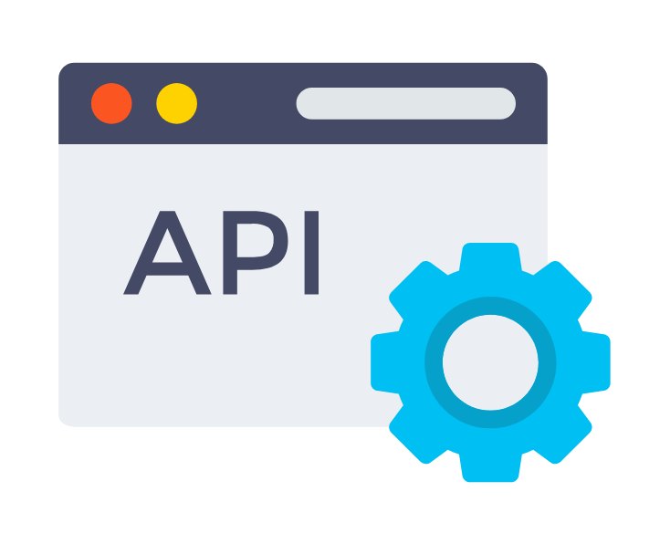

# Portafolio

**Automatizacion · Aseguramiento de Calidad · Mejora Continua**

---

| **Microservicio de Ordenes de Reclamo (Playwright API · Bun · Postman · TypeScript)** | |
|---|---|
| Desarrolle y mantuve un framework de pruebas E2E de API con **Playwright (APIRequestContext)**, organizado en 4 secciones: Auth/Headers, validacion DTO, validacion de empresa e idempotencia HTTP. Implemente **24 casos automatizados** (95.8% exito: 23 PASS / 1 FAIL) y **8 casos manuales** (75% exito: 6 Correcto / 2 No ejecutado). Documente **5 hallazgos** (BUG-001 a BUG-005) con severidad, evidencia y estado de seguimiento.   |  |

---
