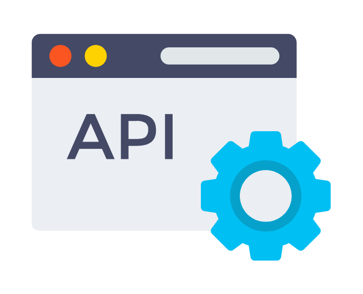
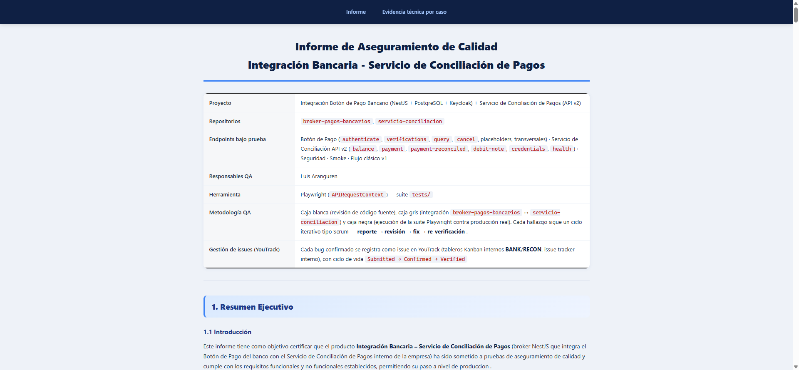
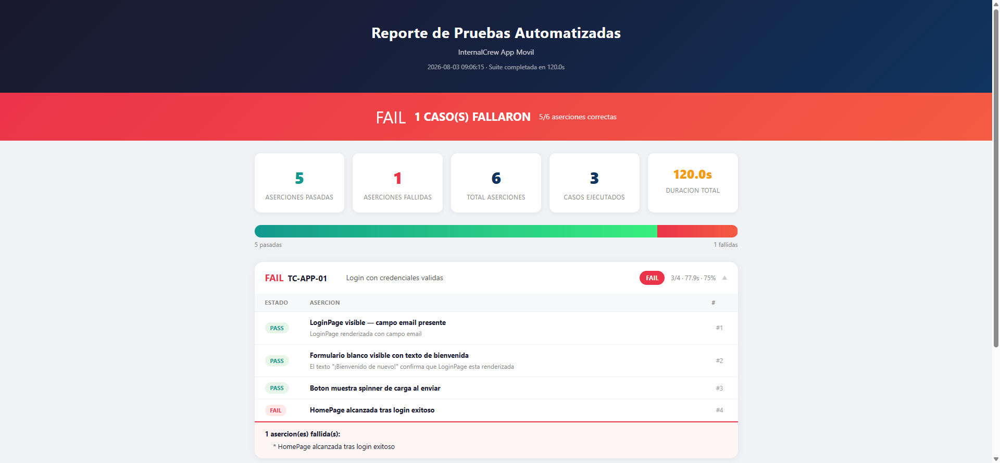

# Portafolio

**Automatizacion · Aseguramiento de Calidad · Mejora Continua**

---

| **Microservicio de Ordenes de Reclamo (Playwright API · Bun · Postman · TypeScript)** | |
|---|---|
| Desarrolle y mantuve un framework de pruebas E2E de API con **Playwright (APIRequestContext)**, organizado en 4 secciones: Auth/Headers, validacion DTO, validacion de empresa e idempotencia HTTP. Implemente **24 casos automatizados** (95.8% exito: 23 PASS / 1 FAIL) y **8 casos manuales** (75% exito: 6 Correcto / 2 No ejecutado). Documente **5 hallazgos** (BUG-001 a BUG-005) con severidad, evidencia y estado de seguimiento.    |  |

---

| **Integracion Boton de Pago Bancario + Servicio de Conciliacion (Playwright API · NestJS · PostgreSQL · Redis · Keycloak)** | |
|---|---|
| Audite y automatice de punta a punta la integracion de un boton de pago bancario con un servicio interno de conciliacion de pagos (NestJS + PostgreSQL + Redis + Keycloak), bajo metodologia de caja blanca, gris y negra contra produccion real. Implemente **132 casos automatizados** con **Playwright (APIRequestContext)** cubriendo autenticacion, verificaciones, consultas, cancelaciones, idempotencia, locks distribuidos de Redis y seguridad. Documente **18 hallazgos** (BUG-001 a BUG-020) con severidad, root cause, evidencia y ciclo de verificacion hasta cierre — **18/18 resueltos y verificados**.    |  |

---

| **Suite QA App Movil + Panel Admin + Chatbot (Appium · WebdriverIO · Flutter · Node.js)** | |
|---|---|
| Disene y automatice pruebas E2E moviles con **Appium + WebdriverIO** sobre una app Flutter (integracion con Flutter Driver via descubrimiento dinamico del puerto del VM service de Dart), cubriendo login, persistencia de sesion y validaciones de formulario. Complemente con QA manual funcional y de regresion sobre un panel administrativo web y un chatbot. Implemente **29 casos automatizados/documentados** en la app movil (24 Correcto/2 Corregir/3 Fallido), **32 casos funcionales + 13 de regresion** en el panel, y **26 casos** en el chatbot (18 Correcto/8 Fallido), con reporte de aserciones HTML propio.    |  |

---
